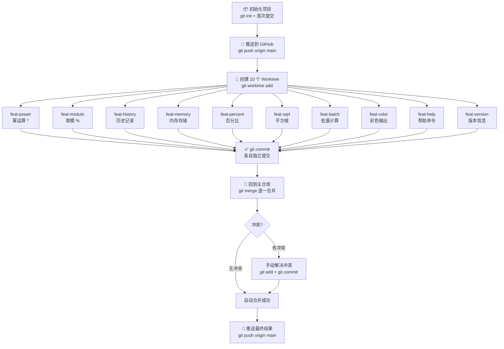

# Git Worktree 完整学习指南

> 通过「极简计算器」项目，亲历 Worktree 从创建到合并的完整流程。

---

## 一、什么是 Git Worktree？

| 概念 | 说明 |
|------|------|
| 普通分支切换 | 同一目录，切换分支时文件会变化，**同时只能工作在一个分支** |
| Git Worktree | 同一个 `.git` 仓库，**映射出多个独立目录**，每个目录对应一个分支，**可以同时工作** |
| 核心价值 | 无需 stash、无需切换，10 个功能同时开发，互不干扰 |

**一句话理解：** Worktree = 同一个仓库的多个"平行工作台"，共享 git 历史，但文件独立。

---

## 二、目录结构（本次演示）

```
AICODE/test/
├── test001/              ← 主仓库 (main 分支)
│   ├── .git/             ← 唯一的 git 数据库（所有 worktree 共享）
│   ├── calc.py
│   └── README.md
│
└── worktrees/            ← 所有 worktree 存放在这里
    ├── feat-power/       ← feat/power 分支的工作目录
    ├── feat-modulo/      ← feat/modulo 分支的工作目录
    ├── feat-history/     ← feat/history 分支的工作目录
    ├── feat-memory/      ← feat/memory 分支的工作目录
    ├── feat-percent/     ← feat/percent 分支的工作目录
    ├── feat-sqrt/        ← feat/sqrt 分支的工作目录
    ├── feat-batch/       ← feat/batch 分支的工作目录
    ├── feat-color/       ← feat/color 分支的工作目录
    ├── feat-help/        ← feat/help 分支的工作目录
    └── feat-version/     ← feat/version 分支的工作目录
```

---

## 三、核心命令速查表

| 操作 | 命令 |
|------|------|
| 创建 worktree（新分支） | `git worktree add <路径> -b <分支名>` |
| 创建 worktree（已有分支） | `git worktree add <路径> <分支名>` |
| 查看所有 worktree | `git worktree list` |
| 删除 worktree | `git worktree remove <路径>` |
| 清理失效 worktree | `git worktree prune` |
| 在 worktree 中提交 | `cd <路径> && git add . && git commit -m "..."` |
| 合并回主分支 | `cd 主仓库 && git merge <分支名>` |

---

## 四、完整工作流程图



---

## 五、本次演示的 Git 提交图（实际输出）

```
*   918f793 Merge branch 'feat/version'
|\
| * ec9a607 feat: 新增版本信息
*   5404b33 Merge branch 'feat/help'
|\
| * 15df071 feat: 新增帮助命令
*   5bfd58f Merge branch 'feat/color'
|\
| * dd15d60 feat: 新增彩色终端输出
*   75a5898 Merge branch 'feat/batch'
|\
| * 74ba860 feat: 新增批量计算功能
*   34f586a Merge branch 'feat/sqrt'
|\
| * cca238a feat: 新增平方根运算
*   ae9df74 Merge branch 'feat/percent'
|\
| * a6be0bd feat: 新增百分比转换
*   08cd841 Merge branch 'feat/memory'
|\
| * 4207092 feat: 新增内存存储 MS/MR/MC
*   265a3f1 merge: 合并历史记录功能
|\
| * 5fff30a feat: 新增历史记录功能
*   9e94629 merge: 解决冲突，合并幂运算+取模运算  ← 这里发生了冲突！
|\
| * 7e67ae9 feat: 新增取模运算 %
* / c38e39f feat: 新增幂运算 ^
|/
* aedbfad feat: 初始化极简计算器 v1.0
```

---

## 六、Worktree vs 其他方案对比

| 方案 | 切换成本 | 并行开发 | 适用场景 |
|------|----------|----------|----------|
| `git checkout` | 高（需 stash） | ❌ 不支持 | 简单单任务 |
| `git stash` | 中 | ❌ 不支持 | 临时保存现场 |
| 克隆多份仓库 | 低 | ✅ 支持 | 但浪费磁盘，历史不共享 |
| **git worktree** | **极低** | **✅ 支持** | **多功能并行开发** ✨ |

---

## 七、关键注意事项

| 注意点 | 说明 |
|--------|------|
| 同一分支不能有两个 worktree | 每个分支只能被 checkout 到一个 worktree |
| 删除 worktree 不删除分支 | `git worktree remove` 只删目录，分支还在 |
| 合并冲突是正常的 | 多人/多功能修改同一文件时必然冲突，手动解决即可 |
| `.git` 只有一个 | 所有 worktree 共享同一个 git 数据库 |

---

## 八、实战步骤回顾

```bash
# 第1步：创建主项目并推送
git init && git add . && git commit -m "init"
git push origin main

# 第2步：批量创建 worktree
git worktree add ../worktrees/feat-power -b feat/power
git worktree add ../worktrees/feat-modulo -b feat/modulo
# ... 重复 10 次

# 第3步：在各 worktree 中独立开发
cd ../worktrees/feat-power
# 修改代码...
git add . && git commit -m "feat: 新增幂运算"

# 第4步：回主仓库逐一合并
cd 主仓库
git merge feat/power
git merge feat/modulo
# 遇到冲突 → 手动解决 → git add → git commit

# 第5步：推送
git push origin main

# 第6步：清理（可选）
git worktree remove ../worktrees/feat-power
git branch -d feat/power
```

---

> GitHub 仓库：https://github.com/nixyme/worktree-demo-calc
